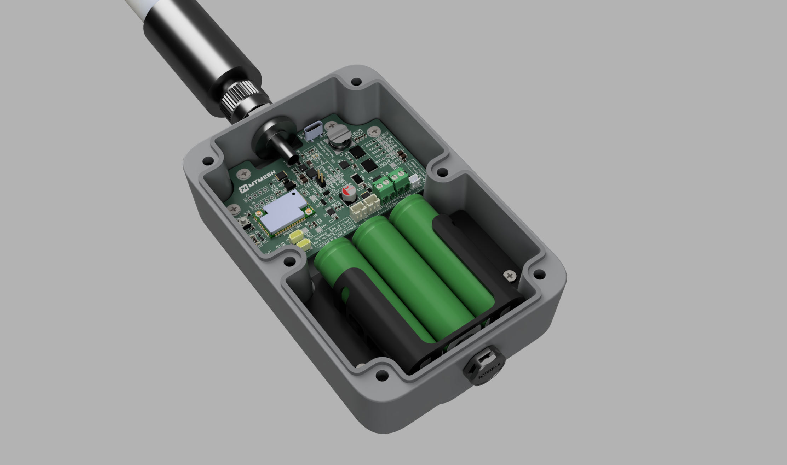
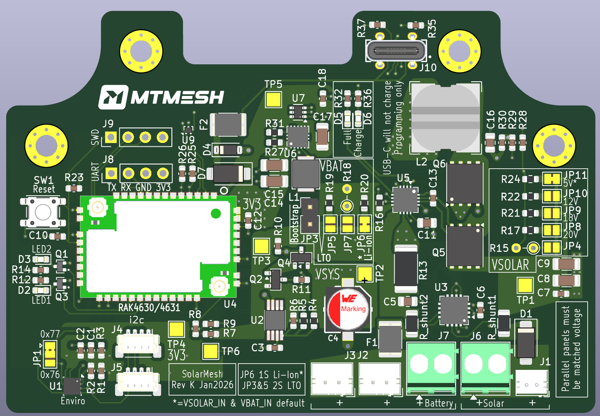

# LoRa Mesh Solar MPPT Charger

An open-source solar MPPT charge controller for unattended Meshtastic nodes. Integrates solar charging, battery protection, power monitoring, and environmental sensing with the RAK4630 LoRa module. Fits the RAK Unify Solar Enclosure with space for a 3×18650 battery sled, N-type antenna bulkhead, and pressure vent.



**Current Revision:** K v1.2  
**WARNING:** Do not fab Rev K board without dead-bugging Q2 & Q4. Rev L incoming.

## Why This Exists

**Inspiration:** MSPMesh's [RAK Unify 150 node build](https://mspmesh.org/rak-unify-150-node-build/) showed what's possible with the RAK Solar Unify Enclosure. This project delivers a similar outcome with tighter integration and more control over components.

**Target platform:** The RAK [Solar Unify Enclosure](https://store.rakwireless.com/products/unify-enclosure-ip67-150x100x45mm-with-pre-mounted-solar-panel) (IP67, 150×100×45mm) with built-in 5V panel. This board fits the upper section; a 3×18650 battery sled fits below. Add a 3dBi antenna and optional vent for a complete weatherproof solar node with ~10,000mAh capacity.

**The problem:** nRF52-based Meshtastic boards can't reliably enter deep sleep below ~3.3V (firmware issue [#4378](https://github.com/meshtastic/firmware/issues/4378)). This causes a destructive cycle:

1. Battery drops to ~3.0V → board attempts sleep
2. Board freezes or browns out
3. Watchdog resets → LoRa TX spike → voltage sag → brownout
4. Repeat until battery damage

Standard charge controllers with ~100mV hysteresis make this worse. This board uses 900mV hysteresis (3.1V cutoff, 4.0V release) so the battery has enough stored energy for reliable cold starts.

## Features



- BQ24650 synchronous buck MPPT charger (90–95% efficiency)
- 5V to 20V panel support via jumper selection
- LTC1540 ultra-low-power UVLO comparator (~1.4µA quiescent when tripped)
- INA3221 3-channel power monitor (solar + battery)
- BME280 environmental sensor (temperature, humidity, pressure)
- TPS63000 buck-boost regulator (3.3V output)
- USB-C for power and firmware updates
- Dual I2C buses (power monitoring separate from sensors)
- Two Qwiic/STEMMA QT expansion ports
- Fits RAK Solar Enclosure IP67 (85×45mm PCB)

## Specifications

| Parameter | Value |
|-----------|-------|
| Input Voltage (Solar) | 5V–20V Vmpp |
| Max Charge Current | 2A |
| Output Voltage | 3.3V regulated |
| UVLO Cutoff (Li-Ion) | 3.12V ±50mV |
| UVLO Release (Li-Ion) | 4.00V ±100mV |
| Hysteresis | 880mV |
| Quiescent (UVLO tripped) | ~1.4µA |
| Switching Frequency | 600kHz |

## Schematic

[Schematic PDF](SchematicRevK.pdf)

---

## Enclosure Assembly

### LoRa Antenna

**WARNING:** The RAK4630 has no built-in LoRa antenna. Connect the antenna before applying power or you'll damage the radio.

The standard Unify enclosure needs a hole drilled for the N-type bulkhead. RAK sells a version with RP-SMA and USB bulkheads pre-installed, but it's $19 more and the port locations interfere with the internal layout—not recommended.

**Drilling:** See MSPMesh's [drilling guide](https://mspmesh.org/rak-unify-150-node-build/) for placement. A stepper bit works well for the case thickness. The RAK4630 uses an MHF1 (U.FL compatible) RF connector.

**Recommended:** [RAK 3dBi Fiberglass Outdoor Antenna](https://store.rakwireless.com/products/3dbi-fiber-glass-antenna) (SKU 915008). Includes antenna, N-Male to MHF1 pigtail, and bulkhead—everything you need.

**Pigtail length:** Keep it short (50–100mm) to minimize signal loss. The RAK kit pigtail works well for the Unify enclosure.

**Mounting:**

| Method | Notes |
|--------|-------|
| Direct mount | Antenna threads onto N-type bulkhead. Simple and compact. |
| External pigtail | Antenna mounts separately. Better for larger antennas or awkward enclosure placement. |

**Wind load:** For direct-mounted antennas, a 5/8" ID fender washer between antenna base and enclosure spreads the load and reduces stress on the plastic. Worth doing for taller antennas or exposed locations.

**Antenna selection:** See [meshtastic/antenna-reports](https://github.com/meshtastic/antenna-reports) for community test data.

### Pressure Vent

A vent prevents condensation from temperature swings and altitude changes.

**Placement:** Mount centrally in the bottom of the enclosure, facing downward. This orientation reduces water ingress risk. The battery sled has an aperture for the vent's retaining nut.

**Sourcing:** IP67 vents available from RAK or cheaper from AliExpress. Some skip the vent entirely—depends on your climate.

### Bluetooth Antenna

**WARNING:** The RAK4630 has no built-in BLE antenna. Connect one before applying power or you'll damage the radio.

| Type | Notes |
|------|-------|
| Internal PCB antenna | Self-adhesive, mounts inside enclosure wall. Simple, works for most cases. |
| External 2.4GHz antenna | Needs another bulkhead. Better range if you need BLE access from a distance. |

**Recommended:** [RAK 2.4GHz WiFi/BLE PCB Antenna](https://store.rakwireless.com/products/ble-pcb-antenna-5-5dbi) (SKU 920091, 5.5dBi). Sticks to the inside of the enclosure wall.

---

## Supported Configurations

### Solar Panels

| Jumper | Panel Vmpp | Notes |
|--------|------------|-------|
| JP11 (default) | 5V | HX-140X90 from RAK Unify enclosure |
| JP10 | 12V | |
| JP9 | 18V | |
| JP8 | 20V | |
| JP7 | Custom | User-defined resistor |

Two identical panels can be wired in parallel for more current. Fuses are rated for 750mA hold to support dual 5V panels (~760mA combined).

### Battery Chemistry

| Jumper | Chemistry | Charge Voltage | UVLO |
|--------|-----------|----------------|------|
| JP6 (default) | 1S Li-Ion | 4.20V | External (LTC1540) |
| JP5 + JP3 | 2S LTO | 5.40V | Internal (TPS63000) |
| JP4 + JP3 | 1S LiFePO4 | ~3.6V | Internal (TPS63000) |

### UVLO Modes

- **External (LTC1540):** 900mV hysteresis (3.1V cutoff, 4.0V release). Used for Li-Ion to prevent the brownout loop.
- **Internal (TPS63000):** 200mV hysteresis (1.5V cutoff, 1.7V release). Bridge JP3 to bypass LTC1540.

**Why JP3 bypass for other chemistries:**

- **LTO:** Safe to 1.5V/cell. The 3.1V external cutoff wastes capacity.
- **LiFePO4:** Max charge (~3.65V) is below the 4.0V release threshold—system would never restart.

### Recommended Battery

3× 18650 cells in parallel (1S/3P). ~10,000mAh capacity, 7–9 days runtime at typical Meshtastic loads.

**Tested:** [Adafruit 3.7V 10050mAh](https://www.adafruit.com/product/5035) with JST-PH connector. Fits the sled, works well.

### 3D Printed Battery Sled

A printable sled for 3×18650 cells is included in this repo. Mounts in the lower section of the Unify enclosure, attaching directly to the case's internal mounting lugs—no need for the RAK insert board.

[STL file for 3×18650 cell pack](Unify_3x18650_Battery_Sled.stl)

---

## Quick Start

### Default Configuration

Factory bridges set up the board for:

- 5V panel (JP11 bridged)
- Li-Ion chemistry (JP6 bridged)
- BME280 at 0x77 (JP1 position A)

No changes needed for HX-140X90 panel + 18650 batteries. Other setups require breaking factory bridges and soldering the right jumper.

### First Power-Up

**WARNING:** Connect BOTH antennas (LoRa and BLE) before applying power. The RAK4630 has no built-in antennas—powering up without them damages the radios.

Li-Ion cells ship at 30–50% SoC (~3.6–3.8V). With a 4.0V release threshold, the board won't start on a new battery alone.

**USB Bootstrap:**

1. Connect USB-C—system powers via D7 Schottky
2. Connect solar—BQ24650 charges battery
3. Wait for battery to hit 4.0V—UVLO releases
4. Disconnect USB—runs on battery

**Solar-only deployment:**

1. Install battery and connect solar
2. Battery charges with load disconnected (UVLO keeps it off)
3. System starts when battery reaches 4.0V

---

## I2C Addresses

| Bus | Address | Device |
|-----|---------|--------|
| I2C1 | 0x42 | INA3221 |
| I2C2 | 0x77 | BME280 (onboard, default) |
| I2C2 | 0x76 | BME280 (external via Qwiic) |

INA3221 at 0x42 is required for Meshtastic firmware.

---

## Jumper Reference

### Panel Selection (bridge ONE)

| Jumper | Vmpp |
|--------|------|
| JP11 | 5V (factory bridged) |
| JP10 | 12V |
| JP9 | 18V |
| JP8 | 20V |
| JP7 | Custom |

### Battery Chemistry (bridge ONE)

| Jumper | Chemistry |
|--------|-----------|
| JP6 | Li-Ion (factory bridged) |
| JP5 | 2S LTO |
| JP4 | Custom |

### Other Jumpers

| Jumper | Function | Default |
|--------|----------|---------|
| JP1 | BME280 address | 0x77 (factory bridged) |
| JP3 | UVLO bypass (for LTO/LiFePO4) | Open |

---

## Connectors

| Ref | Type | Function |
|-----|------|----------|
| J1 | ZH1.5-2P | Solar input (matches HX-140X90 panel) |
| J6 | Screw terminal | Solar input (alt) |
| J2, J3 | JST-PH | Battery |
| J7 | Screw terminal | Battery (alt) |
| J4, J5 | Qwiic | I2C2 expansion |
| J10 | USB-C | Power + data (no battery charging) |
| J8 | 1×04 header | UART debug |
| J9 | 1×04 header | SWD programming |

---

## Meshtastic Configuration

```yaml
telemetry:
  environment_measurement_enabled: true
  power_measurement_enabled: true
  environment_update_interval: 900
  power_update_interval: 900

power:
  device_battery_ina_address: 66  # 0x42
```

---

## Build Tiers

Populate what you need.

### Minimum Viable

Core charging (BQ24650, LTC1540, TPS63000, protection FETs), charge status LEDs (D5, D6), and RAK4630. Solder battery and panel wires directly. Working solar node, no monitoring.

### Typical Build

Add INA3221 for power telemetry, BME280 for environmental data, ZH connector for enclosure panel, JST-PH for battery. Power telemetry is the most useful addition—know your solar harvest and battery state without visiting the site.

### Full Build

Everything populated. Qwiic ports for expansion, debug headers for development.

### Optional Components

| Component | Function | Skip if... |
|-----------|----------|------------|
| U1 (BME280) + R1, R2, R3 | Temperature, humidity, pressure | No environmental data needed |
| U3 (INA3221) + shunts | Solar/battery current monitoring | Only need voltage sensing (install 0Ω bridges) |
| J4, J5 (Qwiic) | I2C expansion ports | No external sensors |
| J6, J7 (screw terminals) | Alt solar/battery connections | Using ZH/PH or soldering |
| J8, J9 (debug headers) | UART/SWD access | No firmware development |
| D2, D3, Q1, Q3, R12, R14 | GPIO indicator LEDs | Don't need extra status LEDs |

---

## BOM Notes

- All components from DigiKey
- Hand assembly via hot plate or reflow oven (no PCBA needed)
- 0603 or larger passives (no 0201) for hand placement
- [Full DigiKey BOM](https://www.digikey.com/en/mylists/list/6RO23TL9P5)

---

## References

- [Meshtastic Firmware Issue #4378](https://github.com/meshtastic/firmware/issues/4378) — nRF52 deep sleep failure
- [Meshtastic Antenna Reports](https://github.com/meshtastic/antenna-reports) — Community antenna testing
- [Voltaic MCSBC-SVR](https://docs.voltaicenclosures.com/mcsbc-svr/) — UVLO hysteresis reference
- [uart.cz Rev E](https://pcb.uart.cz/) — Initial inspiration
- [BQ24650 Datasheet](https://www.ti.com/product/BQ24650)
- [LTC1540 Datasheet](https://www.analog.com/en/products/ltc1540.html)
- [TPS63000 Datasheet](https://www.ti.com/product/TPS63000)

---

## License

[GNU GPL v3](LICENSE)

## Acknowledgments

- MSPMesh — [RAK Unify 150 node build](https://mspmesh.org/rak-unify-150-node-build/)
- Vlastimil Slinták — uart.cz [single board concept](https://uart.cz/2534/solar-mppt-charger-for-meshtastic/)
- YYCMesh — Cold weather field testing
- Austin Mesh, Mesh Coordinators, Meshtastic & MeshCore Discords — Feedback
